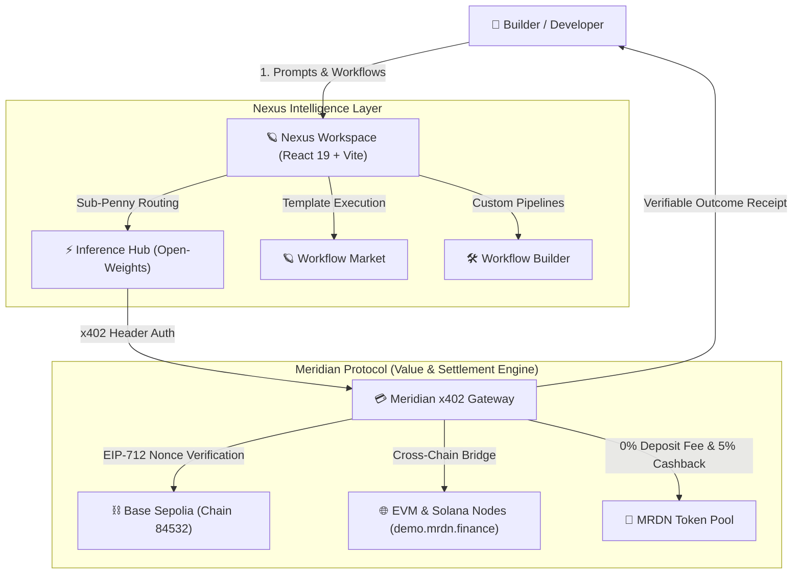

# Nexus — The Open AI Creation & Workflow Marketplace

[](https://johnparente97.github.io/M.NexusPhase1/)
[](https://github.com/johnparente97/M.NexusPhase1/actions)
[](https://mrdn.finance/)

> **Meridian coordinates value, payment routing, and settlement.**  
> **Nexus coordinates intelligence, model execution, workflow orchestration, and user experience.**

---

## ⚡ How Meridian & Nexus Work Together



---

## 🌟 Core Advantages & Highlights

- ⚡ **No Subscriptions & Zero Minimum Balances**: Run high-performance AI models with pay-as-you-go micro-metering.
- 💰 **90%+ Lower Cost vs Centralized APIs**:
  - **Dolphin 8x7B (Uncensored)**: **$0.00** *(100% Free Unlimited)*
  - **DeepSeek R1**: **$0.05 / 1M in** *(95% Cheaper vs o1)*
  - **Llama 3.3 70B**: **$0.04 / 1M in** *(90% Cheaper vs GPT-4o)*
  - **Qwen 2.5 72B**: **$0.05 / 1M in** *(Best for Code)*
  - **Flux 1.1 Pro**: **$0.005 / Image**
- 🎁 **5% MRDN Token Cashback Rewards**: Every paid execution credits 5% cashback directly to the user's Web3 wallet.
- 💳 **0% Deposit Fee with MRDN**: Top up AI balance using MRDN for a **0% fee**, or standard USDC for a 0.5% protocol fee.
- 🔐 **x402 Transfer-with-Authorization**: EIP-712 structured data signing with zero repeated transaction popups.

---

## 🧭 Workspace Architecture

| Workspace | Route | Capability & Function |
| :--- | :--- | :--- |
| **Inference Hub** ⚡ | `/chat` | Sub-penny prompt execution across open-weight models with live model switching. |
| **Workflow Market** 🪐 | `/exchange` | Discover & execute multi-step AI capabilities created by protocol developers. |
| **Model Hub** 🧬 | `/marketplace/models` | Compare latency, benchmark scores, and sub-penny pricing across decentralized hosts. |
| **AI Vault** 💳 | `/balance` | Manage Web3 AI funds, MRDN cashback rewards, and multichain top-ups. |
| **Workflow Builder** 🛠️ | `/studio` | Build, parameterize, and monetize custom AI workflow templates. |
| **Live Activity** 📡 | `/activity` | Telemetry logs, execution history, and verifiable cryptographic outcome receipts. |
| **Dev Hub** 💻 | `/developer` | REST APIs, Model Context Protocol (MCP), and x402 header developer docs. |

---

## 🛠️ Repository Architecture

```
M.NexusPhase1/
├── README.md                           # Product overview & quickstart
├── ARCHITECTURE.md                     # Application architecture & adapter patterns
├── PRODUCT_ALIGNMENT.md                # Meridian vs Nexus boundaries & positioning
├── BACKEND_INTEGRATION_REQUIREMENTS.md # Backend service integration spec
├── MOCKS_AND_GAPS.md                   # Operational vs mocked capabilities matrix
├── QA_TEST_PLAN.md                     # QA test suites & verification checklist
├── HANDOFF.md                          # Handoff guide for Meridian developers
├── apps/
│   ├── api/                            # Cloudflare Worker API (Hono + D1 Database)
│   └── web/                            # Vite + React 19 + Tailwind CSS UI
└── packages/
    ├── shared-types/                   # Shared TypeScript entity types
    └── validation/                     # Zod validation schemas
```

---

## 🌐 Official Meridian x402 Reference Demos

Nexus seamlessly integrates with Meridian's official x402 payment reference architecture:
- 🔗 **Cross-Chain x402**: [https://demo.mrdn.finance/cross-chain](https://demo.mrdn.finance/cross-chain)
- 🔗 **Same-Chain x402 (Base Sepolia)**: [https://demo.mrdn.finance/protected](https://demo.mrdn.finance/protected)
- 🔗 **Solana x402 Protected Route**: [https://demo.mrdn.finance/protected_solana](https://demo.mrdn.finance/protected_solana)

---

## 🚀 Local Development Quickstart

### Prerequisites
- **Node.js**: `v18.0.0+` or `v20.0.0+`
- **npm**: `v9.0.0+`

```bash
# 1. Install workspace dependencies
npm install

# 2. Run TypeScript strict typecheck across all packages
npm run typecheck

# 3. Run unit test suites (Vitest)
npm test

# 4. Build web production bundle
npm run build

# 5. Launch local development servers (Vite + Cloudflare Worker)
npm run dev
```

---

## 🔒 Deployment & Infrastructure

- **Live Application**: [https://johnparente97.github.io/M.NexusPhase1/](https://johnparente97.github.io/M.NexusPhase1/)
- **Protocol Site**: [https://mrdn.finance/](https://mrdn.finance/)
- **Official Docs**: [https://docs.mrdn.finance/](https://docs.mrdn.finance/)
