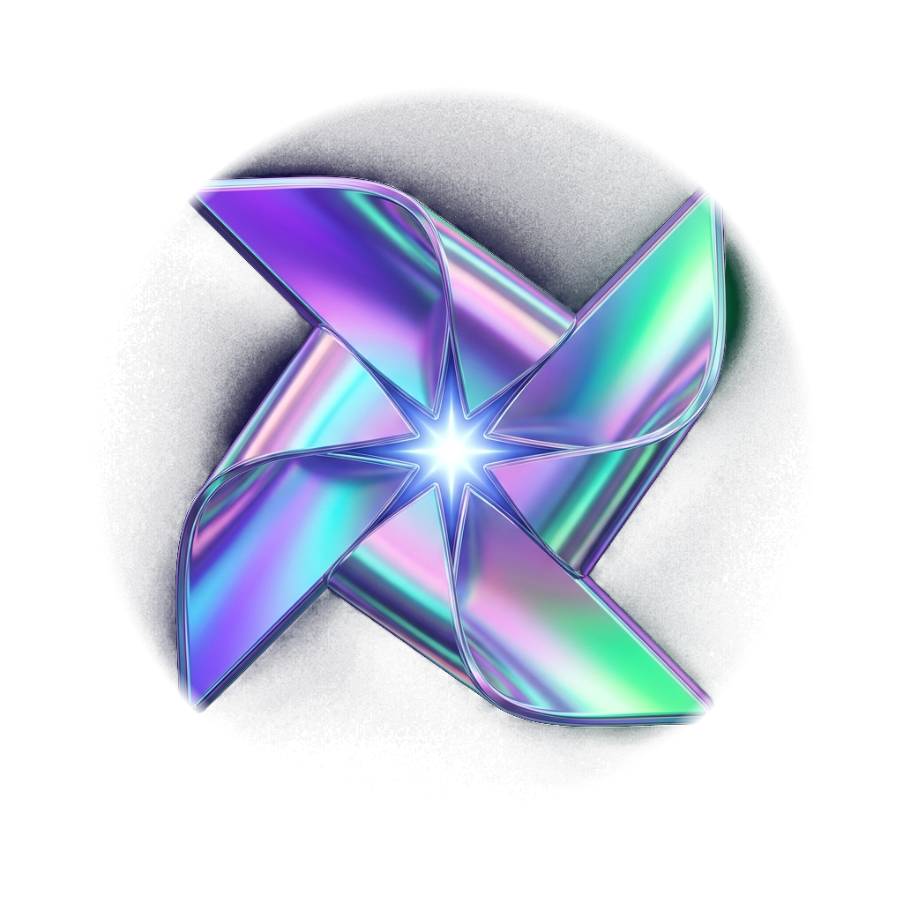
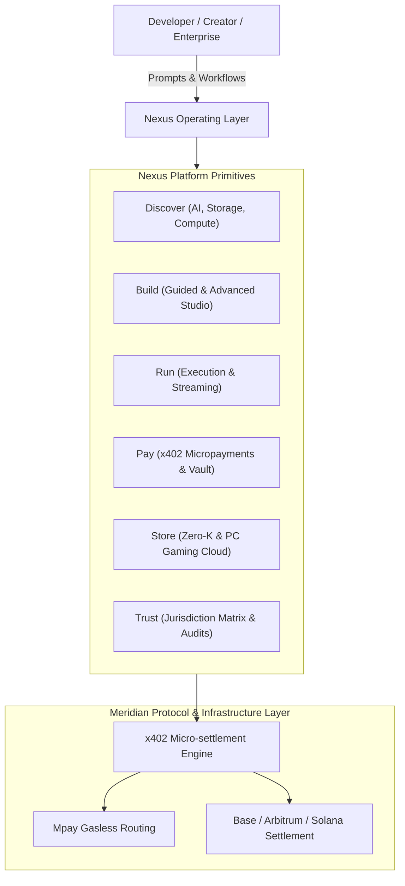

<p align="center">
  
</p>

<h1 align="center">Nexus</h1>
<p align="center"><strong>The Operating Layer for Programmable Digital Commerce</strong></p>
<p align="center"><em>Discover, combine, pay for, and run AI, digital services, infrastructure, and financial tools from one intelligent platform.</em></p>

<p align="center">
  <a href="http://localhost:5173/M.NexusPhase1/"></a>
  <a href="https://johnparente97.github.io/M.NexusPhase1/"></a>
  <a href="https://github.com/johnparente97/M.NexusPhase1/actions"></a>
  <a href="https://mrdn.finance/"></a>
</p>

---

## 🌟 What is Nexus?

**Nexus** is the user-facing application, marketplace, orchestration, and distribution layer for programmable digital services. It leverages Meridian's underlying infrastructure (x402 micro-settlement, multichain payment routing, and account systems) to present a clean, accessible, and production-oriented product experience.

Nexus operates around **Six Platform Pillars**:
1. **Discover**: Models, Agents, Workflows, APIs, Storage Providers, Compute Nodes, DeFi Tools.
2. **Build**: Dual-mode (Guided & Advanced) Workflow Studio, Agent Builder, Budgets, Permissions.
3. **Run**: Execution Engine, Live Activity, Non-Intrusive Streaming Output with "Jump to Latest" control.
4. **Pay**: Meridian x402 Micro-settlements, Unified AI Vault, Spending Policies, Multi-chain Settlement (Base, Arbitrum, Solana).
5. **Store**: Multi-cloud, Decentralized, Zero-Knowledge Encrypted Storage (Filecoin, Arweave, AWS S3, Storj) + PC Gaming Save & Mod Protection.
6. **Trust**: Security Audits, Privacy Controls, Jurisdiction Availability Matrix, Legal Governance Framework.

---

## 🏗️ System Architecture


```mermaid
graph TD
    User["Developer / Creator / Enterprise"] -->|Prompts & Workflows| NexusApp["Nexus Operating Layer"]

    subgraph Pillars["Nexus Platform Primitives"]
        Discover["Discover (AI, Storage, Compute)"]
        Build["Build (Guided & Advanced Studio)"]
        Run["Run (Execution & Streaming)"]
        Pay["Pay (x402 Micropayments & Vault)"]
        Store["Store (Zero-K & PC Gaming Cloud)"]
        Trust["Trust (Jurisdiction Matrix & Audits)"]
    end

    subgraph Meridian["Meridian Protocol & Infrastructure Layer"]
        x402["x402 Micro-settlement Engine"]
        Mpay["Mpay Gasless Routing"]
        Settlement["Base / Arbitrum / Solana Settlement"]
    end

    NexusApp --> Pillars
    Pillars --> x402
    x402 --> Mpay
    x402 --> Settlement
```

---

## 🚀 Workspace & Primary Product Areas

| Area | Route | Description |
| :--- | :--- | :--- |
| **Homepage** | [`/`](https://johnparente97.github.io/M.NexusPhase1/#/) | Clean outcome-first hero, 6-pillar capability gateway, and trust overview. |
| **AI Marketplace** | [`/marketplace/models`](https://johnparente97.github.io/M.NexusPhase1/#/marketplace/models) | Models, Agents, Skills, MCP tools, and interactive Sandbox testing. |
| **Workflow Exchange** | [`/exchange`](https://johnparente97.github.io/M.NexusPhase1/#/exchange) | Discover and run multi-step AI automation templates. |
| **Workflow Studio** | [`/studio`](https://johnparente97.github.io/M.NexusPhase1/#/studio) | Dual-mode (Guided & Advanced) drag-and-drop workflow builder. |
| **Storage Market** | [`/storage`](https://johnparente97.github.io/M.NexusPhase1/#/storage) | Multi-cloud storage comparison, zero-K encryption, version restore, and PC game save protection. |
| **Compute Market** | [`/compute`](https://johnparente97.github.io/M.NexusPhase1/#/compute) | GPU hardware pool (H100, RTX 4090), serverless inference, and carbon reporting. |
| **DeFi Hub** | [`/defi`](https://johnparente97.github.io/M.NexusPhase1/#/defi) | Curated portfolio overview, stablecoin management, yield discovery, and risk disclosures. |
| **Trust Center** | [`/trust`](https://johnparente97.github.io/M.NexusPhase1/#/trust) | Platform telemetry, Jurisdiction Availability Matrix, and complete Legal Governance framework. |
| **AI Vault & Pay** | [`/balance`](https://johnparente97.github.io/M.NexusPhase1/#/balance) | Unified prepaid balances, x402 top-ups, and transaction receipts. |
| **Live Activity** | [`/activity`](https://johnparente97.github.io/M.NexusPhase1/#/activity) | Real-time execution logs and outcome receipts. |
| **Dev Console** | [`/developer`](https://johnparente97.github.io/M.NexusPhase1/#/developer) | API keys, SDKs, webhooks, and provider revenue analytics. |
| **Docs** | [`/docs`](https://johnparente97.github.io/M.NexusPhase1/#/docs) | Architecture guides, API reference, and developer tutorials. |

---

## 💻 Quick Start & Local Development

### Prerequisites
- **Node.js**: `v18+`
- **npm**: `v9+`

### Setup Commands

```bash
# 1. Install dependencies
npm install

# 2. Type-check packages
npm run typecheck

# 3. Build for production
npm run build

# 4. Start local development server
npm run dev
```

The application will launch locally at **[http://localhost:5173/M.NexusPhase1/](http://localhost:5173/M.NexusPhase1/)**

---

## 📁 Repository Structure

```
M.NexusPhase1/
├── apps/
│   ├── web/                 # React 19 + Vite + Tailwind CSS + Framer Motion frontend
│   └── api/                 # Cloudflare Worker API (Hono + D1)
├── packages/
│   ├── shared-types/        # Shared TypeScript interfaces & types
│   └── validation/          # Zod validation schemas
└── docs/                    # Architecture & compliance specifications
    ├── architecture_overview.md
    ├── ARCHITECTURE.md
    ├── PRODUCT_ALIGNMENT.md
    └── ...
```

---

## 🛡️ Compliance, Trust & Security Highlights

- **Jurisdiction Awareness**: Features dynamically indicate location-based availability.
- **Client-Side Zero-Knowledge Encryption**: AES-256 encryption before storage transit.
- **Agent Spending Policies**: Daily/session spend limits, human approval thresholds, and instant kill switch.
- **Accessibility**: WCAG 2.2 AA compliant contrast, semantic HTML, and full keyboard navigation (`⌘K`).

---

<p align="center">
  <sub>© 2026 Nexus Platform · Powered by Meridian Protocol</sub>
</p>
