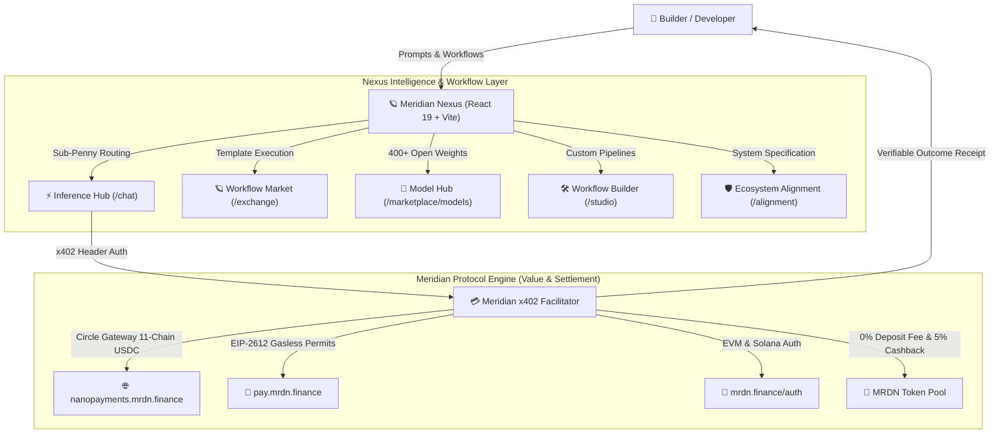

# Meridian Nexus — AI & Workflow Suite

[](https://johnparente97.github.io/M.NexusPhase1/)
[](http://localhost:5173/M.NexusPhase1/)
[](https://github.com/johnparente97/M.NexusPhase1/actions)
[](https://mrdn.finance/)

> **Live Local Development Application**: [http://localhost:5173/M.NexusPhase1/](http://localhost:5173/M.NexusPhase1/)  
> **Production Demo**: [https://johnparente97.github.io/M.NexusPhase1/](https://johnparente97.github.io/M.NexusPhase1/)  
> **Meridian Protocol coordinates value, liquidity, payment routing, and Web3 settlement.**  
> **Meridian Nexus coordinates intelligence, AI model execution, workflow orchestration, and user experience.**

---

## ⚡ Architecture & System Alignment

Meridian Nexus serves as the flagship Intelligence & Workflow Presentation Layer for the **Meridian Ecosystem (`mrdn.finance`)**:


```mermaid
graph TD
    User["👤 Builder / Developer"] -->|Prompts & Workflows| NexusUI["🪐 Meridian Nexus (React 19 + Vite)"]
    
    subgraph "Nexus Intelligence & Workflow Layer"
        NexusUI -->|Sub-Penny Routing| InfHub["⚡ Inference Hub (/chat)"]
        NexusUI -->|Template Execution| WFMarket["🪐 Workflow Market (/exchange)"]
        NexusUI -->|400+ Open Weights| ModelHub["🧬 Model Hub (/marketplace/models)"]
        NexusUI -->|Custom Pipelines| Studio["🛠️ Workflow Builder (/studio)"]
        NexusUI -->|System Specification| AlignPage["🛡️ Ecosystem Alignment (/alignment)"]
    end

    subgraph "Meridian Protocol Engine (Value & Settlement)"
        InfHub -->|x402 Header Auth| x402Gate["💳 Meridian x402 Facilitator"]
        x402Gate -->|Circle Gateway 11-Chain USDC| Nanopayments["🌐 nanopayments.mrdn.finance"]
        x402Gate -->|EIP-2612 Gasless Permits| Mpay["💸 pay.mrdn.finance"]
        x402Gate -->|EVM & Solana Auth| CmdCentre["🔐 mrdn.finance/auth"]
        x402Gate -->|0% Deposit Fee & 5% Cashback| MRDNToken["💎 MRDN Token Pool"]
    end

    x402Gate -->|Verifiable Outcome Receipt| User
```

---

## 🌟 Core Highlights & Advantages

- ⚡ **Zero Subscriptions & No Minimums**: Execute AI models with pay-as-you-go micro-metering and zero recurring commitments.
- 💰 **90%+ Cheaper vs Centralized APIs**:
  - **Dolphin 8x7B (Uncensored)**: **$0.00** *(100% Free Unlimited)*
  - **DeepSeek R1**: **$0.05 / 1M input tokens** *(95% Cheaper vs o1)*
  - **Llama 3.3 70B**: **$0.04 / 1M input tokens** *(90% Cheaper vs GPT-4o)*
  - **Qwen 2.5 72B**: **$0.05 / 1M input tokens** *(Code & Technical Logic)*
  - **Flux 1.1 Pro**: **$0.005 / Image**
- 🎁 **5% MRDN Token Cashback Rewards**: Every model execution automatically credits 5% cashback directly to the user's Web3 wallet.
- 💳 **0% Deposit Fee with MRDN**: Top up AI Vault balance using MRDN for **0% fee**, or USDC for 0.5%.
- 🔐 **x402 Transfer-with-Authorization**: EIP-712 structured data signing with zero repeated transaction popups per prompt execution.

---

## 🧭 Nexus Workspaces & Capabilities Matrix

| Workspace | Route | Capability & Primary Function |
| :--- | :--- | :--- |
| **Inference Hub** ⚡ | `/chat` | Sub-penny prompt execution across open-weight AI models with live model switching. |
| **Workflow Market** 🪐 | `/exchange` | Discover & execute multi-step AI capabilities created by protocol developers. |
| **Model Hub** 🧬 | `/marketplace/models` | Category carousel, latency comparison, and sub-penny pricing across 400+ model hosts. |
| **AI Vault & Payment Suite** 💳 | `/balance` | Multi-rail payment hub: Multichain Top-Up, Circle Gateway, and Mpay gasless transfers. |
| **Workflow Builder** 🛠️ | `/studio` | Build, parameterize, and monetize custom multi-step AI workflow templates. |
| **Ecosystem Alignment** 🛡️ | `/alignment` | Detailed system specification and architectural responsibility breakdown. |
| **Live Activity** 📡 | `/activity` | Telemetry logs, execution history, and verifiable outcome receipts. |
| **Dev Hub & API Console** 💻 | `/developer` | REST APIs (`api.mrdn.finance/v1/inference`), Model Context Protocol (MCP), and x402 docs. |

---

## 📂 Repository Architecture & Documentation

```
M.NexusPhase1/
├── README.md                           # Main repository documentation & quickstart
├── package.json                        # Root workspace scripts (pnpm monorepo)
├── turbo.json                          # Turborepo task pipeline configuration
├── pnpm-workspace.yaml                 # Monorepo workspace declarations
├── tsconfig.json                       # Shared base TypeScript configuration
├── apps/
│   ├── api/                            # Cloudflare Worker API (Hono + D1 Database)
│   └── web/                            # Vite + React 19 + Tailwind CSS UI
├── packages/
│   ├── shared-types/                   # Shared TypeScript entity types
│   └── validation/                     # Zod validation schemas
└── docs/                               # Comprehensive Technical Specifications
    ├── ARCHITECTURE.md                 # System architecture & adapter patterns
    ├── PRODUCT_ALIGNMENT.md            # Meridian Protocol vs Nexus boundaries
    ├── MERIDIAN_BACKEND_INTEGRATION.md # Production backend integration requirements
    ├── BACKEND_INTEGRATION_REQUIREMENTS.md # Service integration specifications
    ├── HANDOFF.md                      # Operational vs mocked capabilities matrix
    ├── MOCKS_AND_GAPS.md               # Mocked fallbacks & production readiness gap analysis
    ├── QA_TEST_PLAN.md                 # Test suites & verification procedures
    ├── CHANGELOG_AUDIT.md              # Project changelog & audit history
    ├── DEPLOYMENT_CHECKLIST.md         # Deployment verification steps
    └── HOSTING_AUDIT.md                # Infrastructure & hosting audit
```

---

## 🌐 Official Meridian Ecosystem Links

- 🌐 **Protocol Mainnet**: [https://mrdn.finance/](https://mrdn.finance/)
- 📖 **Official Developer Docs**: [https://docs.mrdn.finance/](https://docs.mrdn.finance/)
- 💳 **Mpay Gasless Transfers**: [https://pay.mrdn.finance/](https://pay.mrdn.finance/)
- 💸 **Circle Gateway Nanopayments**: [https://nanopayments.mrdn.finance/](https://nanopayments.mrdn.finance/)
- 🔐 **Command Centre Auth**: [https://mrdn.finance/auth](https://mrdn.finance/auth)
- 🚀 **x402 Payment Demos**:
  - [Cross-Chain x402](https://demo.mrdn.finance/cross-chain)
  - [Same-Chain x402 (Base Sepolia)](https://demo.mrdn.finance/protected)
  - [Solana x402 Route](https://demo.mrdn.finance/protected_solana)

---

## 🚀 Development Quickstart

### Prerequisites
- **Node.js**: `v18.0.0+` or `v20.0.0+`
- **npm**: `v9.0.0+`

```bash
# 1. Install monorepo dependencies
npm install

# 2. Run TypeScript strict typecheck across all packages
npm run typecheck

# 3. Run unit test suites (Vitest)
npm test

# 4. Build web production bundle
npm run build

# 5. Launch local development servers (Vite + Cloudflare Worker)
npm run dev
```

---

## 🔒 License & Intellectual Property

Copyright © 2026 Meridian Protocol. All rights reserved.
