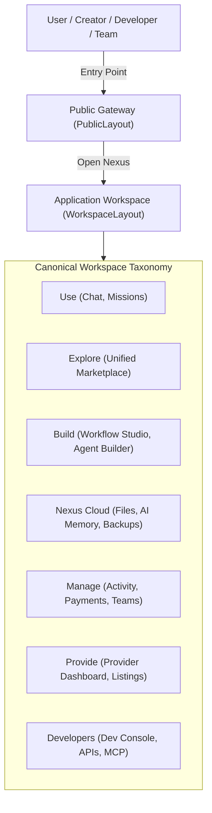

<h1 align="center">Nexus</h1>
<p align="center"><strong>The Intelligent Digital Services Workspace & Ecosystem</strong></p>
<p align="center"><em>Use, build, store, purchase, provide, and manage AI models, agents, workflows, cloud storage, compute, and payments from one unified platform.</em></p>

<p align="center">
  <a href="http://localhost:5173/M.NexusPhase1/"></a>
  <a href="https://johnparente97.github.io/M.NexusPhase1/"></a>
  <a href="https://github.com/johnparente97/Nexus/actions"></a>
</p>

---

## 🌟 What is Nexus?

**Nexus** is an independent application, marketplace, orchestration, cloud, and distribution layer for intelligent digital services. It allows nontechnical users, creators, developers, teams, and providers to discover, build, connect, and monetize digital capabilities without dealing with disconnected infrastructure or complex protocol setups.

Nexus integrates models, tools, storage networks, compute pools, and payment rails—transparently attributing underlying infrastructure partners while maintaining a cohesive, calm, and high-performance product experience.

---

## 🏛️ Product Architecture & Layout System

Nexus is structured into **two distinct layout systems** to balance minimal, outcome-first onboarding with deep, task-focused productivity:

### 1. PublicLayout
Used for public marketing, suite overviews, integrations directories, trust specifications, and documentation (`/`, `/suite`, `/integrations`, `/trust`, `/docs`).
- Minimalist header with Nexus Logo Mark, wordmark, navigation links, and **Open Nexus** CTA.
- Restrained public footer.
- No permanent sidebar or internal workspace tools.

### 2. WorkspaceLayout
Used for internal application tools and workspaces (`/chat`, `/explore`, `/cloud`, `/payments`, `/studio`, `/developer`, etc.).
- **Mission Control Sidebar**: Collapsible navigation organized into canonical product groups.
- **TopNav Header Bar**: ⌘K Search trigger, contextual wallet/balance preview, and user profile menu.
- **Context Inspector & Drawers**: Integrated mobile navigation and workspace controls.


```mermaid
graph TD
    User["User / Creator / Developer / Team"] -->|Entry Point| PublicLayout["Public Gateway (PublicLayout)"]
    PublicLayout -->|Open Nexus| Workspace["Application Workspace (WorkspaceLayout)"]

    subgraph Taxonomy["Canonical Workspace Taxonomy"]
        Use["Use (Chat, Missions)"]
        Explore["Explore (Unified Marketplace)"]
        Build["Build (Workflow Studio, Agent Builder)"]
        Cloud["Nexus Cloud (Files, AI Memory, Backups)"]
        Manage["Manage (Activity, Payments, Teams)"]
        Provide["Provide (Provider Dashboard, Listings)"]
        Devs["Developers (Dev Console, APIs, MCP)"]
      end

    Workspace --> Taxonomy
```

---

## 🚀 Canonical Workspace Taxonomy

| Category | Route | Purpose & Capabilities |
| :--- | :--- | :--- |
| **Home Gateway** | [`/`](https://johnparente97.github.io/M.NexusPhase1/#/) | Minimal public gateway, 4-card suite launcher, and outcome examples. |
| **Chat** | [`/chat`](https://johnparente97.github.io/M.NexusPhase1/#/chat) | AI assistant workspace with Dolphin 8x7B, DeepSeek R1, independent scroll, and streaming completions. |
| **Explore** | [`/explore`](https://johnparente97.github.io/M.NexusPhase1/#/explore) | Unified capability marketplace for Models, Agents, Workflows, Storage, Compute, and APIs. |
| **Build** | [`/studio`](https://johnparente97.github.io/M.NexusPhase1/#/studio) | Guided & Advanced drag-and-drop Workflow Studio and Agent Builder. |
| **Nexus Cloud** | [`/cloud`](https://johnparente97.github.io/M.NexusPhase1/#/cloud) | Files & Folders browser, AI Memory vector indexes, PC Game Save backup vault, and storage providers. |
| **Payments** | [`/payments`](https://johnparente97.github.io/M.NexusPhase1/#/payments) | Prepaid balances, x402 micropayments, spending policies, and transaction receipts. |
| **Activity** | [`/activity`](https://johnparente97.github.io/M.NexusPhase1/#/activity) | Unified execution feed, prompt receipts, and outcome inspection. |
| **Dev Console** | [`/developer`](https://johnparente97.github.io/M.NexusPhase1/#/developer) | API keys, MCP integration, cURL code snippets, and SDK specifications. |
| **Integrations** | [`/integrations`](https://johnparente97.github.io/M.NexusPhase1/#/integrations) | Open architecture directory displaying live, connected, and planned ecosystem infrastructure. |

---

## 💎 Truth-State System

Nexus incorporates a global **Truth-State Model** across all features, cards, balances, and providers:
- **`live`**: Fully operative live Web3 network connection or API endpoint.
- **`connected`**: Active integration verified and ready for usage.
- **`demo`**: Simulated test adapter mode (clearly labeled before, during, and after execution).
- **`planned`**: Scheduled capability roadmap item.

---

## 💻 Quick Start & Running Locally

### Prerequisites
- **Node.js**: `v18.0+`
- **npm**: `v9.0+`

### 1. Installation
```bash
# Clone repository
git clone https://github.com/johnparente97/Nexus.git
cd Nexus

# Install dependencies across workspace
npm install
```

### 2. Run Development Server
```bash
npm run dev
```
The application will launch locally at **[http://localhost:5173/M.NexusPhase1/](http://localhost:5173/M.NexusPhase1/)**

### 3. Verify Code Quality & Type Safety
```bash
# Run TypeScript compilation check
npx tsc --noEmit --project apps/web/tsconfig.json

# Build production bundle
npm run build
```

---

## 🌐 GitHub Pages Live Deployment

Nexus is built with static GitHub Pages hosting support using `createHashRouter` and explicit base path configuration (`/M.NexusPhase1/`).

To deploy to GitHub Pages:
```bash
# Build production bundle
npm run build

# Output is generated in apps/web/dist/ ready for static web server deployment
```

---

## 📁 Monorepo Structure

```
Nexus/
├── apps/
│   ├── web/                 # React 19 + Vite + Tailwind CSS v4 + Framer Motion
│   └── api/                 # Cloudflare Worker API (Hono + D1)
├── packages/
│   ├── shared-types/        # Shared TypeScript interfaces & models
│   └── validation/          # Zod validation schemas
└── docs/                    # Architectural & integration specifications
```

---

<p align="center">
  <sub>© 2026 Nexus Platform · All Rights Reserved</sub>
</p>
