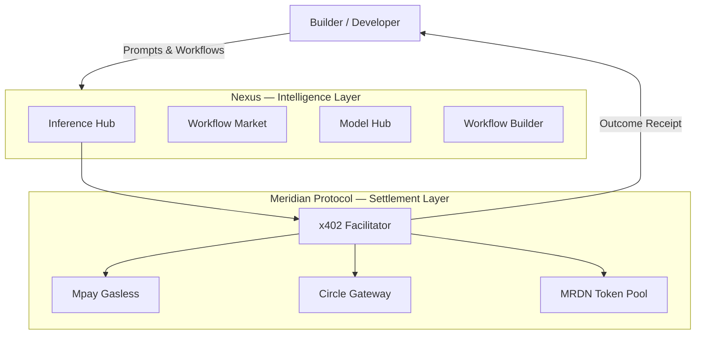

<p align="center">
  
</p>

<h1 align="center">Meridian Nexus</h1>
<p align="center"><strong>The AI & Workflow Suite for the Meridian Ecosystem</strong></p>

<p align="center">
  <a href="https://johnparente97.github.io/M.NexusPhase1/"></a>
  <a href="https://github.com/johnparente97/M.NexusPhase1/actions"></a>
  <a href="https://mrdn.finance/"></a>
</p>

---

## What is Meridian Nexus?

Meridian Nexus is the official intelligence and workflow layer for the [Meridian Protocol](https://mrdn.finance/). It provides a complete workspace for running AI models, building multi-step workflows, and settling payments — all connected to Meridian's on-chain infrastructure.

| Layer | Responsibility |
| :--- | :--- |
| **Meridian Protocol** | Value, liquidity, payment routing, and Web3 settlement |
| **Meridian Nexus** | Intelligence, AI model execution, workflow orchestration, and user experience |

---

## Architecture


```mermaid
graph TD
    User["Builder / Developer"] -->|Prompts & Workflows| Nexus["Meridian Nexus"]

    subgraph Nexus["Nexus — Intelligence Layer"]
        InfHub["Inference Hub"]
        WFMarket["Workflow Market"]
        ModelHub["Model Hub"]
        Studio["Workflow Builder"]
    end

    subgraph Protocol["Meridian Protocol — Settlement Layer"]
        x402["x402 Facilitator"]
        Mpay["Mpay Gasless"]
        Gateway["Circle Gateway"]
        Token["MRDN Token Pool"]
    end

    InfHub --> x402
    x402 --> Mpay
    x402 --> Gateway
    x402 --> Token
    x402 -->|Outcome Receipt| User
```

---

## Workspaces

| Workspace | Route | Description |
| :--- | :--- | :--- |
| **Inference Hub** | `/chat` | Run open-weight AI models at sub-penny rates with live model switching |
| **Workflow Market** | `/exchange` | Discover and execute multi-step AI workflows built by other developers |
| **Model Hub** | `/marketplace/models` | Browse 400+ models with pricing, latency, and benchmark comparisons |
| **AI Vault** | `/balance` | Manage funds across Multichain Top-Up, Circle Gateway, and Mpay |
| **Workflow Builder** | `/studio` | Build, parameterize, and publish custom AI workflow templates |
| **Ecosystem Alignment** | `/alignment` | System architecture spec and responsibility breakdown |
| **Live Activity** | `/activity` | Execution history, telemetry, and verifiable outcome receipts |
| **Dev Console** | `/developer` | REST API docs, MCP integration, and x402 payment header specs |

---

## Why Nexus?

- **No subscriptions, no minimums** — pay per prompt with micro-metering
- **90%+ cheaper** than centralized APIs (e.g. Llama 3.3 70B at $0.04/1M tokens)
- **5% MRDN cashback** on every paid execution
- **0% deposit fee** when topping up with MRDN tokens
- **x402 settlement** — EIP-712 signed, on-chain verifiable, zero transaction popups

---

## Quick Start

**Prerequisites:** Node.js `v18+` and npm `v9+`

```bash
# Install dependencies
npm install

# Type-check all packages
npm run typecheck

# Run tests
npm test

# Build for production
npm run build

# Start local dev server
npm run dev
```

The app will be available at **`http://localhost:5173/M.NexusPhase1/`**

---

## Project Structure

```
M.NexusPhase1/
├── apps/
│   ├── web/                 # React 19 + Vite + Tailwind CSS frontend
│   └── api/                 # Cloudflare Worker API (Hono + D1)
├── packages/
│   ├── shared-types/        # Shared TypeScript types
│   └── validation/          # Zod schemas
└── docs/                    # Technical specifications
    ├── ARCHITECTURE.md
    ├── PRODUCT_ALIGNMENT.md
    ├── HANDOFF.md
    └── ...
```

---

## Meridian Ecosystem

| Service | URL |
| :--- | :--- |
| Protocol | [mrdn.finance](https://mrdn.finance/) |
| Docs | [docs.mrdn.finance](https://docs.mrdn.finance/) |
| Mpay | [pay.mrdn.finance](https://pay.mrdn.finance/) |
| Nanopayments | [nanopayments.mrdn.finance](https://nanopayments.mrdn.finance/) |
| Command Centre | [mrdn.finance/auth](https://mrdn.finance/auth) |
| x402 Demos | [demo.mrdn.finance](https://demo.mrdn.finance/) |

---

<p align="center">
  <sub>© 2026 Meridian Protocol · All rights reserved</sub>
</p>
